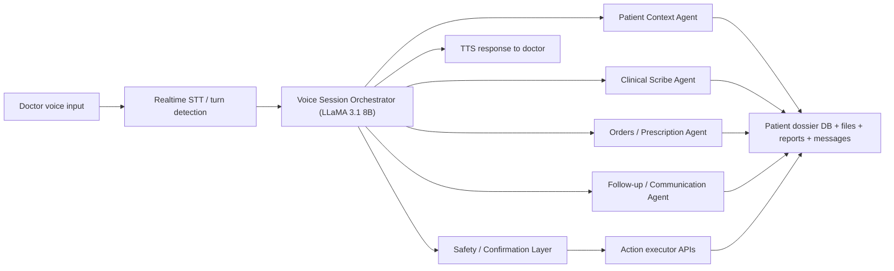

# Voice Agent Workflow for Doctor Post-Patient Lifecycle

## Goal
Enable doctors to manage the full post-patient lifecycle using voice, while keeping the system safe, auditable, and operationally reliable.

This workflow should allow a doctor to use speech to:
- retrieve patient context
- summarize recent clinical history
- create and update notes
- manage prescriptions and medicines
- schedule follow-ups
- trigger patient communication
- review reports, scans, transcripts, and reminders

> **Refactored against DB_CONDITION.md** — All backend API endpoint paths, request/response field names, data types, and query logic have been corrected to match the real FastAPI backend (`backend/routers/`) and the actual `lib/db/schema.ts`. Conflicts are called out inline. Architecture, agent logic, and orchestration code are unchanged where they do not touch DB-bound data.

---

## Conflicts In Original Plan

| # | Location | Original | Corrected | Reason |
|---|----------|----------|-----------|--------|
| 1 | `BackendClient.get_patient_dossier` | calls `/doctor/patients/{id}` | calls `/doctor/patients/{id}/dossier` | The plain `GET /doctor/patients/{id}` returns basic patient+scans+reports only. The dossier endpoint returns the full unified payload |
| 2 | `BackendClient.create_voice_note` | `{ scanId, transcription }` → `/voice-notes` | must supply a real `scan_id` integer — voice agent cannot fabricate one from `patient_id` | `voice_notes.scan_id` is the only FK; there is no `patient_id` on the table. The agent must resolve a valid scan ID for the patient first |
| 3 | `execute_pending_node` — create_note | `client.create_voice_note(scan_id=plan["patient_id"], ...)` | `scan_id` ≠ `patient_id` — these are different integer IDs | The original code passes `patient_id` as `scan_id`, which would insert a voice note linked to the wrong or non-existent scan |
| 4 | `BackendClient.create_medication` | `{ patientId, drugName, ... }` | payload fields must match `CreateMedicationRequest`: `patientId`, `drugName`, `dosage`, `form`, `frequency`, `timeOfDay` (list), `duration`, `startDate`, `endDate`, `instructions`, `prescriptionId` | `timeOfDay` is a list, not a string; `is_active` and `added_by` are not accepted as input |
| 5 | `BackendClient.create_appointment` | `doctor_id: str` | `doctor_id` is an **integer** from `users.id`, not a string | All PKs in the schema are integers |
| 6 | `context_agent.py` | reads `dossier.get("medications", [])` | dossier response key is `records.medications` not top-level `medications` | The `/doctor/patients/{id}/dossier` endpoint nests all records under `records` |
| 7 | `context_agent.py` | reads `dossier.get("scans", [])` and `dossier.get("appointments", [])` | dossier response keys are `records.scans` and `records.appointments` | Same nesting issue |
| 8 | `context_agent.py` | `s.get('uploaded_at',''))[:10]` used for date display | `uploaded_at` is an integer Unix ms timestamp, not an ISO string — `[:10]` slicing produces garbage | Must format with `datetime.fromtimestamp(s['uploaded_at']/1000).strftime(...)` |
| 9 | `followup_agent.py` | `scheduled_at: parsed.isoformat()` | `appointments.scheduled_at` is stored as integer Unix ms in SQLite | Backend `CreateAppointmentRequest.scheduledAt` accepts an ISO string and the backend converts it, so this is acceptable at the API call layer — but the validator `datetime.fromisoformat(sa)` is correct |
| 10 | `GraphState.doctor_id` | typed as `str` | doctor's `users.id` is an integer; Clerk user ID (`clerk_id`) is a string — the graph uses `participant.identity` which is the Clerk ID string, but backend API calls that need `doctor_id` as a DB integer must resolve it from the session | Distinguished below: `doctor_clerk_id` (string) vs `doctor_db_id` (integer) |
| 11 | `BackendClient.search_patients` | fetches all patients with `GET /users/patients` and filters client-side | correct endpoint and behavior — no change needed | Already correct |
| 12 | `voice.py` token endpoint | registered under prefix `/voice` → `/voice/token` | frontend calls `${BACKEND_URL}/voice/token` — consistent | No change needed, but `backend/main.py` must include the new router (noted in checklist) |
| 13 | `build_action_plan_node` | `"doctor_id": state["doctor_id"]` where `doctor_id` is Clerk ID string | backend write endpoints authenticate via JWT, not by passing `doctor_id` in body — the `BackendClient` already handles this via `Authorization` header | No body change needed; just confirm `BackendClient` is initialized with the doctor token from session |

---

## Recommended High-Level Architecture

Use a hybrid architecture:
- `Next.js` remains the doctor-facing UI and control surface
- a separate `Python voice-agent service` handles speech, orchestration, and agent execution
- `LLaMA 3.1 8B` handles basic orchestration, intent parsing, slot filling, and structured planning
- all state-changing actions are routed through explicit confirmation and safety checks
- long-running automation is managed through durable workflows



---

## End-to-End Workflow

Example doctor voice command:

`Open Priya Sharma. Summarize the last visit. Add a note that cough has improved. Continue azithromycin for three days. Schedule follow-up next Tuesday.`

Backend flow:
1. Capture audio from browser or telephony input.
2. Convert speech to partial and final transcript.
3. Run the transcript through the voice session orchestrator.
4. Detect intent and required entities.
5. Fetch patient dossier context.
6. Route to the correct agent or tool chain.
7. Build a structured action plan.
8. Run safety validation.
9. Read back all state-changing actions.
10. Ask for confirmation.
11. Commit writes only after confirmation.
12. Speak back the result and persist audit logs.

---

## Core Agents

The system should begin with 5 focused agents.

### 1. Voice Session Orchestrator
Purpose:
- own the active voice session
- classify intent
- route tasks to the right agent
- ask clarifying questions
- manage confirmations and retries

Model:
- `LLaMA 3.1 8B Instruct`

Responsibilities:
- session state
- active patient selection
- turn management
- tool selection
- structured output generation

### 2. Patient Context Agent
Purpose:
- fetch and summarize patient dossier data
- answer clinical-history questions
- provide compact structured context to other agents

Responsibilities:
- retrieve scans, reports, notes, meds, appointments, files, transcripts, messages
- summarize latest events
- surface allergies, risks, and open follow-ups

Data sources:
- patient dossier API (`GET /doctor/patients/{id}/dossier`)
- notes and records DB
- attached files and reports

### 3. Clinical Scribe Agent
Purpose:
- convert doctor dictation into structured notes
- produce visit summaries and handoff notes
- create well-formed clinical draft records

Responsibilities:
- note drafting
- formatting into structured templates
- extracting follow-up instructions from free speech

Outputs:
- draft clinical note
- summary blocks
- structured JSON for saving

### 4. Orders / Prescription Agent
Purpose:
- manage medication updates and medicine instructions
- convert voice commands into structured medication actions

Responsibilities:
- create draft medication entries
- add dosage, frequency, duration, timing
- flag missing fields
- check for duplicate or conflicting entries

Outputs:
- medication draft
- medicine item list
- update plan requiring confirmation

### 5. Follow-up / Communication Agent
Purpose:
- manage all post-visit follow-up automation
- draft and trigger communication tasks

Responsibilities:
- schedule appointments
- create reminders
- send patient messages
- queue email, SMS, or call workflows
- monitor unfinished tasks

Outputs:
- appointment actions
- reminder tasks
- message drafts
- workflow jobs

---

## Safety and Confirmation Layer

This should be implemented as a system layer, not a casual prompt rule.

It must:
- confirm patient identity before any write action
- require explicit confirmation for:
  - medications
  - follow-up scheduling
  - patient communications
  - updates to important clinical notes
- enforce doctor-only permissions
- run deterministic validation before writes
- maintain audit logs of:
  - transcript
  - interpreted action plan
  - final committed action

---

## Recommended Technologies

### Frontend and Doctor UI
- `Next.js` existing app
- microphone capture from browser
- optional push-to-talk or always-listening mode with turn detection

### Voice / Realtime Layer
- `LiveKit Agents` for browser-native real-time voice workflows
- `Twilio Media Streams` if phone-call workflows are required

### Orchestration and Agents
- `LangGraph` for graph-based orchestration and multi-step tool workflows
- or `Llama Stack Agents` if you want a more LLaMA-native agent stack

### Model Serving
- `LLaMA 3.1 8B Instruct`
- serve using `vLLM`

### Speech-to-Text
- managed option: `Deepgram`
- self-hosted option: `faster-whisper`

### Text-to-Speech
- managed option through LiveKit-compatible providers
- self-hosted option: `Piper`

### Durable Workflow Automation
- `Temporal`

### Retrieval
- start with direct DB queries for structured records via backend API
- add semantic retrieval later using:
  - `Qdrant`
  - `pgvector`

---

## Possible Implementation Approaches

### Approach 1: Command-First Voice Copilot
Doctor speaks short commands and the system confirms each state-changing action.

Pros:
- fastest to implement
- safer
- lower hallucination risk
- good first version

Cons:
- less conversational

### Approach 2: Conversational Clinical Assistant
Doctor interacts naturally over multiple turns and the system maintains session memory.

Pros:
- better UX
- more natural interaction

Cons:
- more complex state management
- higher risk without strict safety controls

### Approach 3: Telephony Workflow
The same voice agents are used over doctor/patient phone calls or reminder calls.

Pros:
- supports remote care and reminders
- aligns with existing Twilio direction in the repo

Cons:
- added latency and infra complexity

---

## Recommended Build Order

Start with `Approach 1`, then expand.

### Phase 1: Voice Copilot V1
Support only:
- retrieve patient summary
- create note draft
- schedule follow-up

### Phase 2: Medication and Prescription Support
Add:
- medication drafting
- medication changes
- allergy and risk checks

### Phase 3: Communication and Automation
Add:
- patient message drafting
- reminders
- follow-up workflow automation
- durable execution

### Phase 4: Full Conversational Workflow
Add:
- richer multi-turn conversation
- contextual follow-ups
- doctor handoff support
- telephony support if needed

---

## Example Doctor Workflows

### Workflow 1: Quick Summary
Doctor says:
`Open Rahul Verma and summarize the last visit.`

System actions:
- resolve patient identity
- fetch latest dossier from `/doctor/patients/{id}/dossier`
- summarize scans, reports, notes, meds, appointments from `records.*`
- speak response

### Workflow 2: Add Follow-Up Note
Doctor says:
`Add a note that the patient reports reduced chest pain and better sleep.`

System actions:
- draft note
- resolve a recent scan ID for this patient (required to create a voice note)
- read back summary
- ask for save confirmation
- store note via `POST /voice-notes`

### Workflow 3: Update Medication
Doctor says:
`Continue amoxicillin 500 mg twice daily for five more days.`

System actions:
- parse medication details
- check patient context and active medications via `GET /medications?patientId={id}`
- draft medication update
- confirm before save via `POST /medications`

### Workflow 4: Schedule Follow-Up
Doctor says:
`Schedule follow-up next Tuesday at 4 PM and remind the patient one day before.`

System actions:
- create appointment draft
- create reminder workflow
- confirm
- persist via `POST /appointments` and trigger downstream automation

### Workflow 5: Communication Review
Doctor says:
`Read the latest unread messages from Priya and draft a reply.`

System actions:
- fetch conversation history via `GET /conversations` then `GET /conversations/{id}/messages`
- summarize unread messages
- draft reply
- wait for approval before sending via `POST /conversations/{id}/messages`

---

## Suggested Agent-Tool Mapping

### Voice Session Orchestrator Tools
- `select_patient`
- `get_patient_summary`
- `draft_note`
- `draft_medication`
- `schedule_followup`
- `draft_message`
- `commit_action`
- `cancel_action`

### Patient Context Agent Tools
- `fetch_dossier`
- `fetch_latest_report`
- `fetch_latest_scan`
- `fetch_active_medicines`
- `fetch_appointments`
- `fetch_files`
- `fetch_voice_transcripts`

### Clinical Scribe Agent Tools
- `create_note_draft`
- `format_structured_note`
- `extract_followup_tasks`

### Orders / Prescription Agent Tools
- `create_medication_draft`
- `validate_medicine_details`
- `check_duplicate_medication`
- `check_allergy_flags`

### Follow-up / Communication Agent Tools
- `create_appointment_draft`
- `schedule_reminder_workflow`
- `create_message_draft`
- `queue_call_or_sms`

---

## Safety Principles

The system should follow these principles:
- voice can draft, but not silently commit critical changes
- patient identity must be explicit before write operations
- all medication changes must be confirmed
- communication to patients should remain human-approved
- every action should be auditable
- long-running work should not depend on short-lived chat session memory

---

## Best-Fit Recommendation for This Repo

Because the current project is already:
- `Next.js`
- `TypeScript`
- `Drizzle`
- `SQLite`
- a separate `Python` ML service

the most practical architecture is:
- `Next.js` for doctor UI
- a separate `Python voice-agent service`
- `LiveKit Agents`
- `LangGraph`
- `vLLM` serving `LLaMA 3.1 8B`
- `Deepgram` or `faster-whisper` for STT
- `Temporal` for workflow automation

If stronger Meta alignment is important, replace `LangGraph` with `Llama Stack Agents`.

---

## First Build Recommendation

Build the first version as a `voice command copilot`, not a fully autonomous conversational doctor agent.

Start with these 3 supported tasks:
- `retrieve patient summary`
- `create or update note`
- `schedule follow-up`

Once those are stable, add:
- medication workflows
- patient communication workflows
- durable follow-up automations

---

## Future Extensions

Possible future additions:
- telephony-based doctor or patient workflows
- multilingual doctor dictation
- smart handoff summaries between visits
- medication adherence monitoring
- proactive reminder escalations
- doctor dashboard voice inbox

---

## References

- LiveKit Agents voice pipelines
- Twilio Media Streams
- Meta LLaMA 3.1 8B Instruct
- vLLM OpenAI-compatible serving
- Llama Stack Agents
- LangGraph workflows and agents
- Temporal durable workflows
- Deepgram streaming STT
- faster-whisper

---

---

# HOW TO IMPLEMENT THIS PLAN

> Everything below answers "How?" for every "What?" defined above. It is organized to match the build phases and can be executed top-to-bottom by any developer working on this repo.

---

## Implementation Overview

### Where the Voice Service Lives in the Repo

Following the existing backend/frontend split, the voice agent service is a **third top-level directory**:

```
VaidyaVision/
├── backend/          ← FastAPI: business logic, DB, ML, OCR, RAG  (port 8000)
├── frontend/         ← Next.js: UI, Drizzle schema                (port 3000)
└── voice-agent/      ← NEW: Python voice agent service            (port 8001)
    ├── main.py
    ├── requirements.txt
    ├── .env.example
    ├── core/
    ├── agents/
    ├── graph/
    ├── tools/
    ├── safety/
    ├── audio/
    └── workflows/
```

The voice agent service calls the existing FastAPI backend over HTTP for all database operations. It never accesses the database directly. This keeps the DB access layer clean and single-owner.

```
Browser mic  →  LiveKit  →  voice-agent (8001)  →  backend API (8000)  →  SQLite
```

---

## Full Directory Structure

```
voice-agent/
│
├── main.py                          ← LiveKit agent entry point
├── requirements.txt
├── .env.example
│
├── core/
│   ├── __init__.py
│   ├── config.py                    ← All env vars
│   ├── session.py                   ← VoiceSession state object
│   └── backend_client.py            ← HTTP client for backend API calls
│
├── agents/
│   ├── __init__.py
│   ├── orchestrator.py              ← Voice Session Orchestrator (LLaMA routing)
│   ├── context_agent.py             ← Patient Context Agent
│   ├── scribe_agent.py              ← Clinical Scribe Agent
│   ├── prescription_agent.py        ← Orders / Prescription Agent
│   └── followup_agent.py            ← Follow-up / Communication Agent
│
├── graph/
│   ├── __init__.py
│   ├── voice_graph.py               ← LangGraph StateGraph definition
│   ├── nodes.py                     ← All graph node functions
│   └── state.py                     ← GraphState TypedDict
│
├── safety/
│   ├── __init__.py
│   ├── validator.py                 ← Deterministic pre-commit validation
│   └── audit_logger.py              ← Append-only audit log writer
│
├── audio/
│   ├── __init__.py
│   ├── stt.py                       ← Deepgram / faster-whisper adapter
│   └── tts.py                       ← TTS adapter (LiveKit-compatible)
│
└── workflows/
    ├── __init__.py
    └── temporal_client.py           ← Temporal workflow trigger client (Phase 3)
```

---

## Algorithm: How a Voice Turn Is Processed

This is the master algorithm. Every single voice turn follows these exact steps in order.

```
ALGORITHM: process_voice_turn(audio_chunk)

INPUT:  raw audio bytes from browser microphone
OUTPUT: spoken TTS response + committed or staged actions

STEP 1 — TRANSCRIPTION
  transcript = stt.transcribe(audio_chunk)
  if transcript is empty or below confidence threshold:
      return tts.speak("I didn't catch that. Could you repeat?")

STEP 2 — SESSION GUARD
  session = get_or_create_session(doctor_id)

STEP 3 — INTENT CLASSIFICATION  [LLaMA 3.1 8B — temperature 0.0]
  intent_result = orchestrator.classify_intent(
      transcript=transcript,
      active_patient=session.active_patient,
  )
  # Returns one of:
  #   { intent: "get_summary",       entities: { patient_name? } }
  #   { intent: "create_note",       entities: { text, patient_name? } }
  #   { intent: "update_medication", entities: { drug_name, dosage?, frequency?, duration? } }
  #   { intent: "schedule_followup", entities: { date, time? } }
  #   { intent: "send_message",      entities: { message_text } }
  #   { intent: "confirm",           entities: {} }
  #   { intent: "cancel",            entities: {} }
  #   { intent: "unknown",           entities: {} }

STEP 4 — CONFIRMATION HANDLING  [short-circuit before patient resolution]
  if intent_result.intent == "confirm":
      if session.pending_action is None:
          return tts.speak("There is nothing pending to confirm.")
      result = execute_pending_action(session)
      audit_logger.log(session, result)
      session.clear_pending()
      return tts.speak(result.confirmation_message)

  if intent_result.intent == "cancel":
      session.clear_pending()
      return tts.speak("Action cancelled.")

STEP 5 — PATIENT RESOLUTION  [only if patient name in entities or not yet selected]
  if intent_result.entities.patient_name AND session.active_patient is None:
      matches = backend.search_patients(intent_result.entities.patient_name)
      if len(matches) == 0:
          return tts.speak("I couldn't find that patient.")
      if len(matches) > 1:
          return tts.speak(f"Did you mean {name_A} or {name_B}?")
      session.set_active_patient(matches[0])

  write_intents = {create_note, update_medication, schedule_followup, send_message}
  if intent is in write_intents AND session.active_patient is None:
      return tts.speak("Please open a patient first.")

STEP 6 — ROUTE TO AGENT GRAPH  [LangGraph StateGraph]
  graph_result = voice_graph.invoke({
      transcript:    transcript,
      intent:        intent_result.intent,
      entities:      intent_result.entities,
      active_patient: session.active_patient,
      doctor_id:     session.doctor_id,
      session_id:    session.session_id,
  })
  # graph_result contains:
  #   { action_plan, action_type, response_text, requires_confirmation }

STEP 7 — SAFETY VALIDATION  [deterministic — always runs before any write]
  if graph_result.action_plan is not None:
      error = validator.validate(graph_result.action_plan, session)
      if error:
          return tts.speak(f"I can't do that: {error}")

STEP 8 — CONFIRMATION GATE  [all write actions must be staged]
  if graph_result.requires_confirmation:
      session.set_pending(graph_result.action_plan)
      return tts.speak(f"{readback_of_plan}. Should I go ahead?")

STEP 9 — EXECUTE  [read-only actions bypass confirmation]
  result = execute_action(graph_result.action_plan)
  audit_logger.log(session, result)
  return tts.speak(graph_result.response_text)
```

---

## LangGraph State Machine Design

### State Definition

```python
# voice-agent/graph/state.py
from typing import TypedDict, Optional
from enum import Enum

class Intent(str, Enum):
    GET_SUMMARY        = "get_summary"
    CREATE_NOTE        = "create_note"
    UPDATE_MEDICATION  = "update_medication"
    SCHEDULE_FOLLOWUP  = "schedule_followup"
    SEND_MESSAGE       = "send_message"
    CONFIRM            = "confirm"
    CANCEL             = "cancel"
    UNKNOWN            = "unknown"

class ActionType(str, Enum):
    READ   = "read"     # No confirmation required
    WRITE  = "write"    # Confirmation required before commit

class GraphState(TypedDict):
    # ── Input ──────────────────────────────────────────────────
    transcript:          str
    # CORRECTED: doctor_id here is the Clerk user ID (string) used as LiveKit
    # participant identity. The DB integer ID (users.id) is resolved from the
    # session's active user record and passed separately where needed.
    doctor_id:           str       # Clerk ID — string
    session_id:          str

    # ── Resolved by classify + resolve nodes ───────────────────
    intent:              Optional[str]
    entities:            Optional[dict]
    active_patient:      Optional[dict]

    # ── Agent draft outputs ─────────────────────────────────────
    context_summary:     Optional[str]
    note_draft:          Optional[dict]
    prescription_draft:  Optional[dict]
    followup_draft:      Optional[dict]
    message_draft:       Optional[dict]

    # ── Execution plan ──────────────────────────────────────────
    action_plan:         Optional[dict]
    action_type:         Optional[str]          # "read" | "write"
    requires_confirmation: bool

    # ── Output ──────────────────────────────────────────────────
    response_text:       Optional[str]
    validation_error:    Optional[str]
    committed:           bool
```

### Graph Structure (Visual)

```
[START]
   │
   ▼
[classify_intent]                 ← LLaMA 3.1 8B: transcript → { intent, entities }
   │
   ├── intent=confirm  ──────────────────────────────────► [execute_pending] → [END]
   ├── intent=cancel   ──────────────────────────────────► [cancel_pending]  → [END]
   ├── write intent + no patient ───────────────────────► [ask_patient_selection] → [END]
   │
   ▼
[resolve_patient]                 ← search backend by patient_name entity
   │
   ├── ambiguous ────────────────────────────────────────► [ask_clarification] → [END]
   │
   ▼
[route_to_agent]                  ← conditional edge based on intent
   │
   ├── get_summary       ──► [run_context_agent]
   ├── create_note        ──► [run_scribe_agent]
   ├── update_medication  ──► [run_prescription_agent]
   └── schedule_followup
       send_message       ──► [run_followup_agent]
                                    │
                                    ▼
                           [build_action_plan]
                                    │
                                    ▼
                           [run_safety_check]
                                    │
                           ├── failed  ─────────────────► [END]
                                    │
                           ├── action_type=read ─────────► [execute_action]        → [END]
                           └── action_type=write ────────► [stage_for_confirmation] → [END]
```

### Graph Implementation

```python
# voice-agent/graph/voice_graph.py
from langgraph.graph import StateGraph, END
from .state import GraphState
from .nodes import (
    classify_intent_node, resolve_patient_node, route_to_agent_node,
    run_context_agent_node, run_scribe_agent_node,
    run_prescription_agent_node, run_followup_agent_node,
    build_action_plan_node, run_safety_check_node,
    stage_for_confirmation_node, execute_action_node,
    execute_pending_node, cancel_pending_node,
    ask_clarification_node, ask_patient_selection_node,
)


def build_voice_graph() -> StateGraph:
    g = StateGraph(GraphState)

    g.add_node("classify_intent",          classify_intent_node)
    g.add_node("resolve_patient",          resolve_patient_node)
    g.add_node("route_to_agent",           route_to_agent_node)
    g.add_node("run_context_agent",        run_context_agent_node)
    g.add_node("run_scribe_agent",         run_scribe_agent_node)
    g.add_node("run_prescription_agent",   run_prescription_agent_node)
    g.add_node("run_followup_agent",       run_followup_agent_node)
    g.add_node("build_action_plan",        build_action_plan_node)
    g.add_node("run_safety_check",         run_safety_check_node)
    g.add_node("stage_for_confirmation",   stage_for_confirmation_node)
    g.add_node("execute_action",           execute_action_node)
    g.add_node("execute_pending",          execute_pending_node)
    g.add_node("cancel_pending",           cancel_pending_node)
    g.add_node("ask_clarification",        ask_clarification_node)
    g.add_node("ask_patient_selection",    ask_patient_selection_node)

    g.set_entry_point("classify_intent")

    g.add_conditional_edges("classify_intent", _route_after_classify, {
        "confirm":      "execute_pending",
        "cancel":       "cancel_pending",
        "need_patient": "ask_patient_selection",
        "continue":     "resolve_patient",
    })

    g.add_conditional_edges("resolve_patient", _route_after_resolve, {
        "ambiguous": "ask_clarification",
        "resolved":  "route_to_agent",
    })

    g.add_conditional_edges("route_to_agent", _route_to_agent, {
        "context":      "run_context_agent",
        "scribe":       "run_scribe_agent",
        "prescription": "run_prescription_agent",
        "followup":     "run_followup_agent",
    })

    for node in ["run_context_agent", "run_scribe_agent",
                 "run_prescription_agent", "run_followup_agent"]:
        g.add_edge(node, "build_action_plan")

    g.add_edge("build_action_plan", "run_safety_check")

    g.add_conditional_edges("run_safety_check", _route_after_safety, {
        "failed": END,
        "read":   "execute_action",
        "write":  "stage_for_confirmation",
    })

    for node in ["execute_action", "stage_for_confirmation", "execute_pending",
                 "cancel_pending", "ask_clarification", "ask_patient_selection"]:
        g.add_edge(node, END)

    return g.compile()


def _route_after_classify(state: GraphState) -> str:
    intent = state.get("intent", "unknown")
    if intent == "confirm":
        return "confirm"
    if intent == "cancel":
        return "cancel"
    write_intents = {"create_note", "update_medication", "schedule_followup", "send_message"}
    if intent in write_intents and not state.get("active_patient"):
        return "need_patient"
    return "continue"

def _route_after_resolve(state: GraphState) -> str:
    return "ambiguous" if state.get("validation_error") == "ambiguous_patient" else "resolved"

def _route_to_agent(state: GraphState) -> str:
    return {
        "get_summary":        "context",
        "create_note":        "scribe",
        "update_medication":  "prescription",
        "schedule_followup":  "followup",
        "send_message":       "followup",
    }.get(state.get("intent", ""), "context")

def _route_after_safety(state: GraphState) -> str:
    if state.get("validation_error"):
        return "failed"
    return state.get("action_type", "read")


voice_graph = build_voice_graph()
```

---

## Node Implementations

```python
# voice-agent/graph/nodes.py
import datetime
from .state import GraphState, ActionType
from ..agents.orchestrator import classify_intent_with_llm
from ..agents.context_agent import build_patient_summary
from ..agents.scribe_agent import draft_clinical_note
from ..agents.prescription_agent import draft_prescription_update
from ..agents.followup_agent import draft_followup_or_message
from ..core.backend_client import BackendClient
from ..safety.validator import validate_action_plan
from ..safety.audit_logger import AuditLogger


def classify_intent_node(state: GraphState) -> GraphState:
    result = classify_intent_with_llm(
        transcript=state["transcript"],
        active_patient=state.get("active_patient"),
    )
    return {**state, "intent": result["intent"], "entities": result["entities"]}


def resolve_patient_node(state: GraphState) -> GraphState:
    if state.get("active_patient"):
        return state
    patient_name = (state.get("entities") or {}).get("patient_name")
    if not patient_name:
        return state
    client  = BackendClient()
    matches = client.search_patients(patient_name)
    if len(matches) == 0:
        return {**state, "validation_error": "patient_not_found",
                "response_text": f"I couldn't find a patient named {patient_name}."}
    if len(matches) > 1:
        names = ", ".join(p["name"] for p in matches[:3])
        return {**state, "validation_error": "ambiguous_patient",
                "response_text": f"I found multiple patients: {names}. Which one did you mean?"}
    return {**state, "active_patient": matches[0], "validation_error": None}


def route_to_agent_node(state: GraphState) -> GraphState:
    return state


def run_context_agent_node(state: GraphState) -> GraphState:
    # CORRECTED: calls /doctor/patients/{id}/dossier, not /doctor/patients/{id}
    dossier = BackendClient().get_patient_dossier(state["active_patient"]["id"])
    summary = build_patient_summary(dossier)
    return {**state, "context_summary": summary, "action_type": ActionType.READ,
            "requires_confirmation": False, "response_text": summary}


def run_scribe_agent_node(state: GraphState) -> GraphState:
    raw_text = (state.get("entities") or {}).get("text", state["transcript"])
    draft    = draft_clinical_note(raw_text=raw_text, patient=state["active_patient"])
    return {**state, "note_draft": draft, "action_type": ActionType.WRITE,
            "requires_confirmation": True,
            "response_text": f"I'll add a note: \"{draft['content']}\". Should I save this?"}


def run_prescription_agent_node(state: GraphState) -> GraphState:
    # CORRECTED: get_active_medications returns list filtered from /medications endpoint
    active_meds = BackendClient().get_active_medications(state["active_patient"]["id"])
    draft       = draft_prescription_update(
        entities=state.get("entities") or {},
        patient=state["active_patient"],
        active_medications=active_meds,
    )
    if draft.get("missing_fields"):
        return {**state, "validation_error": "missing_fields",
                "response_text": f"I need more info: {', '.join(draft['missing_fields'])}."}
    readback = (f"I'll update {draft['drug_name']} {draft['dosage']} "
                f"{draft['frequency']} for {draft['duration']}. Confirm?")
    return {**state, "prescription_draft": draft, "action_type": ActionType.WRITE,
            "requires_confirmation": True, "response_text": readback}


def run_followup_agent_node(state: GraphState) -> GraphState:
    draft = draft_followup_or_message(
        intent=state.get("intent"),
        entities=state.get("entities") or {},
        patient=state["active_patient"],
    )
    if state.get("intent") == "schedule_followup":
        readback = f"I'll schedule a follow-up on {draft.get('scheduled_at', '?')}. Confirm?"
        return {**state, "followup_draft": draft, "action_type": ActionType.WRITE,
                "requires_confirmation": True, "response_text": readback}
    readback = f"Draft message: \"{draft.get('content', '')}\". Send it?"
    return {**state, "message_draft": draft, "action_type": ActionType.WRITE,
            "requires_confirmation": True, "response_text": readback}


def build_action_plan_node(state: GraphState) -> GraphState:
    plan = {
        # doctor_id here is the Clerk ID string — auth is handled via JWT header in BackendClient,
        # not by passing doctor_id in the request body to any write endpoint.
        "doctor_id":  state["doctor_id"],
        "patient_id": state["active_patient"]["id"] if state.get("active_patient") else None,
        "timestamp":  datetime.datetime.utcnow().isoformat(),
    }
    if state.get("note_draft"):
        plan["type"] = "create_note"
        plan["note_draft"] = state["note_draft"]
    elif state.get("prescription_draft"):
        plan["type"] = "update_medication"
        plan["prescription_draft"] = state["prescription_draft"]
    elif state.get("followup_draft"):
        plan["type"] = "schedule_followup"
        plan["followup_draft"] = state["followup_draft"]
    elif state.get("message_draft"):
        plan["type"] = "send_message"
        plan["message_draft"] = state["message_draft"]
    elif state.get("context_summary"):
        plan["type"] = "read_summary"
    return {**state, "action_plan": plan}


def run_safety_check_node(state: GraphState) -> GraphState:
    error = validate_action_plan(
        plan=state.get("action_plan"),
        doctor_id=state["doctor_id"],
        active_patient=state.get("active_patient"),
    )
    if error:
        return {**state, "validation_error": error,
                "response_text": f"I can't do that: {error}"}
    return state


def stage_for_confirmation_node(state: GraphState) -> GraphState:
    return {**state, "committed": False}


def execute_action_node(state: GraphState) -> GraphState:
    AuditLogger().log(
        session_id=state["session_id"], doctor_id=state["doctor_id"],
        transcript=state["transcript"], action_plan=state.get("action_plan"),
        outcome="executed_read",
    )
    return {**state, "committed": True}


def execute_pending_node(state: GraphState) -> GraphState:
    plan   = state.get("action_plan")
    if not plan:
        return {**state, "response_text": "Nothing to confirm."}
    client = BackendClient()
    response, outcome = "Done.", "unknown"

    if plan["type"] == "create_note":
        # CORRECTED: voice_notes requires a scan_id, not patient_id.
        # Resolve the most recent scan for this patient and use its id.
        # The plan must carry a resolved scan_id set by run_scribe_agent_node.
        scan_id = plan.get("scan_id")
        if not scan_id:
            return {**state, "response_text": "Cannot save note: no scan found for this patient.",
                    "committed": False}
        client.create_voice_note(scan_id=scan_id, transcription=plan["note_draft"]["content"])
        response, outcome = "Note saved.", "note_created"

    elif plan["type"] == "update_medication":
        # CORRECTED: create_medication accepts the full medication payload
        # matching CreateMedicationRequest — see backend_client.py
        client.create_medication(patient_id=plan["patient_id"],
                                 data=plan["prescription_draft"])
        d = plan["prescription_draft"]
        response = f"Medication updated: {d['drug_name']}."
        outcome  = "medication_updated"

    elif plan["type"] == "schedule_followup":
        client.create_appointment(patient_id=plan["patient_id"],
                                  data=plan["followup_draft"])
        response = f"Follow-up scheduled for {plan['followup_draft']['scheduled_at']}."
        outcome  = "followup_scheduled"

    elif plan["type"] == "send_message":
        client.send_message(conversation_data=plan["message_draft"])
        response, outcome = "Message sent.", "message_sent"

    AuditLogger().log(
        session_id=state["session_id"], doctor_id=state["doctor_id"],
        transcript=state["transcript"], action_plan=plan, outcome=outcome,
    )
    return {**state, "committed": True, "response_text": response, "action_plan": None}


def cancel_pending_node(state: GraphState) -> GraphState:
    return {**state, "action_plan": None, "response_text": "Action cancelled."}


def ask_clarification_node(state: GraphState) -> GraphState:
    return state

def ask_patient_selection_node(state: GraphState) -> GraphState:
    return {**state, "response_text": "Please tell me which patient you'd like to open first."}
```

> **Note on `run_scribe_agent_node` and scan resolution:** When the intent is `create_note`, the node must also fetch the patient's most recent scan and store its `id` in the plan as `scan_id`. This is required because `POST /voice-notes` takes `{ scanId, transcription }` and `voice_notes.scan_id` is the only FK. Update `run_scribe_agent_node` to call `BackendClient().get_latest_scan_id(patient_id)` and include it in the draft.

---

## Agent Implementations

### Orchestrator — LLaMA Intent Classifier

```python
# voice-agent/agents/orchestrator.py
import json
import httpx
from datetime import date
from ..core.config import settings

INTENT_SYSTEM_PROMPT = """
You are a medical voice assistant. Extract the intent and entities from the
doctor's voice command.

Supported intents:
  get_summary        → entities: patient_name?
  create_note        → entities: text, patient_name?
  update_medication  → entities: drug_name, dosage?, frequency?, duration?, patient_name?
  schedule_followup  → entities: date (ISO), time?, patient_name?
  send_message       → entities: message_text, patient_name?
  confirm            → entities: {}
  cancel             → entities: {}
  unknown            → entities: {}

Rules:
- Return ONLY valid JSON: {{ "intent": "<intent>", "entities": {{ ... }} }}
- Resolve relative dates (e.g. "next Tuesday") to ISO date format.
- Today is {today}.
"""

def classify_intent_with_llm(transcript: str, active_patient: dict | None) -> dict:
    system = INTENT_SYSTEM_PROMPT.format(today=date.today().isoformat())
    context = f"Active patient: {active_patient['name']}.\n" if active_patient else ""
    user    = f"{context}Doctor said: \"{transcript}\""

    r = httpx.post(
        f"{settings.VLLM_BASE_URL}/v1/chat/completions",
        json={
            "model":    settings.LLM_MODEL,
            "messages": [{"role": "system", "content": system},
                         {"role": "user",   "content": user}],
            "temperature":     0.0,
            "max_tokens":      256,
            "response_format": {"type": "json_object"},
        },
        timeout=10,
    )
    r.raise_for_status()
    result = json.loads(r.json()["choices"][0]["message"]["content"])
    return {"intent": result.get("intent", "unknown"), "entities": result.get("entities", {})}
```

### Patient Context Agent

```python
# voice-agent/agents/context_agent.py
import datetime

def build_patient_summary(dossier: dict) -> str:
    """
    CORRECTED: dossier response nests all records under 'records'.
    Keys are records.scans, records.medications (from /medications endpoint),
    records.appointments — not top-level keys.

    Also CORRECTED: uploaded_at and scheduled_at are integer Unix ms timestamps,
    not ISO strings. Use datetime.fromtimestamp(ms/1000) to format them.
    """
    p     = dossier.get("patient", {})
    rec   = dossier.get("records", {})
    scans = rec.get("scans", [])
    meds  = rec.get("medications", [])      # CORRECTED: was dossier.get("medications")
    appts = rec.get("appointments", [])     # CORRECTED: was dossier.get("appointments")

    last_scan = "none on record"
    if scans:
        s = scans[0]
        # CORRECTED: uploaded_at is integer Unix ms — format properly
        ts = s.get("uploaded_at")
        date_str = (datetime.datetime.fromtimestamp(ts / 1000).strftime("%Y-%m-%d")
                    if ts else "unknown date")
        last_scan = (f"{s.get('modality', '')} on {date_str}, "
                     f"diagnosis: {s.get('ai_diagnosis') or 'pending'}")

    active_meds = [f"{m['drug_name']} {m.get('dosage', '')} {m.get('frequency', '')}"
                   for m in meds if m.get("is_active")]
    med_text    = ", ".join(active_meds) if active_meds else "none"

    last_appt = "none"
    if appts:
        a = appts[0]
        # CORRECTED: scheduled_at is integer Unix ms
        ts = a.get("scheduled_at")
        date_str = (datetime.datetime.fromtimestamp(ts / 1000).strftime("%Y-%m-%d")
                    if ts else "unknown date")
        last_appt = f"{a.get('type', '')} on {date_str}"

    history = (p.get("medical_history") or "")[:100] or "none documented"

    return (
        f"Patient: {p.get('name', '?')}, {p.get('age', '?')} years, "
        f"{p.get('gender', '?')}, blood type {p.get('blood_type', '?')}. "
        f"Last scan: {last_scan}. "
        f"Active medications: {med_text}. "
        f"Last appointment: {last_appt}. "
        f"Medical history: {history}."
    )
```

### Clinical Scribe Agent

```python
# voice-agent/agents/scribe_agent.py
import json, httpx, datetime
from ..core.config import settings

SCRIBE_SYSTEM = """
Convert the doctor's dictation into a structured clinical note. Return ONLY valid JSON:
{
  "content":   "<professional medical note text>",
  "note_type": "progress_note" | "follow_up" | "prescription_note",
  "flags":     ["<any follow-up task mentioned>"]
}
Do not invent clinical details not present in the input.
"""

def draft_clinical_note(raw_text: str, patient: dict) -> dict:
    r = httpx.post(
        f"{settings.VLLM_BASE_URL}/v1/chat/completions",
        json={
            "model": settings.LLM_MODEL,
            "messages": [
                {"role": "system", "content": SCRIBE_SYSTEM},
                {"role": "user",   "content": f"Patient: {patient['name']}\nDictation: \"{raw_text}\""},
            ],
            "temperature": 0.2, "max_tokens": 512,
            "response_format": {"type": "json_object"},
        },
        timeout=15,
    )
    r.raise_for_status()
    draft = json.loads(r.json()["choices"][0]["message"]["content"])
    draft.setdefault("timestamp", datetime.datetime.utcnow().isoformat())
    return draft
```

### Prescription Agent

```python
# voice-agent/agents/prescription_agent.py
import json, httpx
from ..core.config import settings

PRESCRIPTION_SYSTEM = """
Parse the doctor's medication command into structured JSON. Return ONLY:
{
  "drug_name":    "<n>",
  "dosage":       "<dose with unit, e.g. 500mg>",
  "form":         "tablet" | "capsule" | "syrup" | "injection" | "cream" | "drops",
  "frequency":    "<e.g. twice daily>",
  "duration":     "<e.g. 5 days>",
  "instructions": "<e.g. after meals>",
  "missing_fields": ["<required fields that are absent>"]
}
Required fields: drug_name, dosage, frequency.
"""

def draft_prescription_update(entities: dict, patient: dict, active_medications: list) -> dict:
    if all(k in entities for k in ["drug_name", "dosage", "frequency"]):
        draft = {
            "drug_name": entities["drug_name"], "dosage": entities["dosage"],
            "form": entities.get("form", "tablet"), "frequency": entities["frequency"],
            "duration": entities.get("duration", ""), "instructions": entities.get("instructions", ""),
            "missing_fields": [],
        }
    else:
        r = httpx.post(
            f"{settings.VLLM_BASE_URL}/v1/chat/completions",
            json={
                "model": settings.LLM_MODEL,
                "messages": [
                    {"role": "system", "content": PRESCRIPTION_SYSTEM},
                    {"role": "user",   "content": f"Doctor said: \"{entities.get('raw_command', '')}\""},
                ],
                "temperature": 0.0, "max_tokens": 256,
                "response_format": {"type": "json_object"},
            },
            timeout=10,
        )
        r.raise_for_status()
        draft = json.loads(r.json()["choices"][0]["message"]["content"])

    # Duplicate check against active medications
    for med in active_medications:
        if med.get("drug_name", "").lower() == draft["drug_name"].lower() and med.get("is_active"):
            draft["duplicate_warning"] = (
                f"{draft['drug_name']} is already active "
                f"({med.get('dosage')} {med.get('frequency')}). This will add a new entry."
            )
            break
    return draft
```

### Follow-up / Communication Agent

```python
# voice-agent/agents/followup_agent.py
import dateparser

def draft_followup_or_message(intent: str, entities: dict, patient: dict) -> dict:
    if intent == "schedule_followup":
        raw      = f"{entities.get('date', '')} {entities.get('time', '')}".strip()
        parsed   = dateparser.parse(raw, settings={"PREFER_DATES_FROM": "future"})
        return {
            "patient_id":   patient["id"],   # integer
            "type":         "follow_up",     # matches appointments.type enum
            "scheduled_at": parsed.isoformat() if parsed else None,
            "notes":        entities.get("notes", "Doctor-scheduled voice follow-up"),
            "status":       "scheduled",     # matches appointments.status enum
        }
    # send_message
    return {
        "patient_id": patient["id"],   # integer
        "content":    entities.get("message_text", ""),
        "type":       "text",          # matches messages.type enum
    }
```

---

## Backend Client

```python
# voice-agent/core/backend_client.py
import httpx
from .config import settings

class BackendClient:
    """
    HTTP client that calls the FastAPI backend (port 8000).
    The voice agent never touches the DB directly.
    Pass doctor_token to make authenticated calls on the doctor's behalf.
    """
    def __init__(self, doctor_token: str = ""):
        self.base    = settings.BACKEND_URL
        self.headers = {"Authorization": f"Bearer {doctor_token}"} if doctor_token else {}

    def _get(self, path, params=None):
        r = httpx.get(f"{self.base}{path}", params=params, headers=self.headers, timeout=10)
        r.raise_for_status(); return r.json()

    def _post(self, path, body):
        r = httpx.post(f"{self.base}{path}", json=body, headers=self.headers, timeout=10)
        r.raise_for_status(); return r.json()

    def search_patients(self, name: str) -> list:
        patients = self._get("/users/patients").get("patients", [])
        return [p for p in patients if name.lower() in p.get("name", "").lower()]

    def get_patient_dossier(self, patient_id: int) -> dict:
        # CORRECTED: use the dossier endpoint which returns the full unified payload
        # under response.records.* — not the basic /doctor/patients/{id} endpoint
        return self._get(f"/doctor/patients/{patient_id}/dossier")

    def get_latest_scan_id(self, patient_id: int) -> int | None:
        """
        NEW: Required for voice note creation. voice_notes.scan_id is the only FK —
        there is no patient_id on the voice_notes table. Fetch the most recent scan
        for this patient and return its integer ID.
        """
        scans = self._get("/scans", {"patientId": patient_id}).get("scans", [])
        if not scans:
            return None
        # scans are returned ordered by uploaded_at DESC from the backend
        return scans[0]["id"]

    def get_active_medications(self, patient_id: int) -> list:
        return [m for m in self._get("/medications", {"patientId": patient_id}).get("medications", [])
                if m.get("is_active")]

    def create_voice_note(self, scan_id: int, transcription: str) -> dict:
        # CORRECTED: scan_id must be a real scan integer ID for this patient,
        # not the patient_id. Use get_latest_scan_id() to resolve it first.
        return self._post("/voice-notes", {"scanId": scan_id, "transcription": transcription})

    def create_medication(self, patient_id: int, data: dict) -> dict:
        # CORRECTED: field names match CreateMedicationRequest exactly.
        # timeOfDay must be a list (e.g. ["morning", "evening"]), not a string.
        # added_by and is_active are set by the backend, not accepted as input.
        return self._post("/medications", {
            "patientId":    patient_id,
            "drugName":     data.get("drug_name"),
            "dosage":       data.get("dosage"),
            "form":         data.get("form"),
            "frequency":    data.get("frequency"),
            "timeOfDay":    data.get("time_of_day", []),   # list, not string
            "duration":     data.get("duration"),
            "instructions": data.get("instructions"),
        })

    def create_appointment(self, patient_id: int, data: dict) -> dict:
        # CORRECTED: doctor_id is NOT passed here — the backend resolves the
        # doctor from the JWT token (current_user). Only patient-facing fields needed.
        # If the doctor is booking for a patient, patientId identifies the patient.
        return self._post("/appointments", {
            "patientId":   patient_id,           # integer
            "scheduledAt": data.get("scheduled_at"),
            "type":        data.get("type", "follow_up"),
            "notes":       data.get("notes"),
        })

    def send_message(self, conversation_data: dict) -> dict:
        # Find or create conversation by patient_id (integer)
        conv    = self._post("/conversations", {"otherUserId": conversation_data["patient_id"]})
        conv_id = conv["conversation"]["id"]
        return self._post(f"/conversations/{conv_id}/messages",
                          {"content": conversation_data.get("content"), "type": "text"})
```

---

## Safety Validator

```python
# voice-agent/safety/validator.py
from datetime import datetime

WRITE_TYPES = {"create_note", "update_medication", "schedule_followup", "send_message"}

def validate_action_plan(plan: dict | None, doctor_id: str, active_patient: dict | None) -> str | None:
    """
    Deterministic rule-based validation. Never calls LLM or backend.
    Returns an error string on failure, None on success.
    """
    if plan is None:
        return None

    t = plan.get("type")

    # Writes require an active, matching patient
    if t in WRITE_TYPES:
        if not active_patient:
            return "No patient is selected."
        if plan.get("patient_id") != active_patient["id"]:
            return "Patient ID mismatch. Action aborted."

    # Doctor identity must be present
    if t in WRITE_TYPES and not doctor_id:
        return "Doctor identity could not be verified."

    # Medication: required fields
    if t == "update_medication":
        draft = plan.get("prescription_draft", {})
        for f in ["drug_name", "dosage", "frequency"]:
            if not draft.get(f):
                return f"Prescription is missing a required field: {f}."

    # Note: scan_id must be resolved before committing
    if t == "create_note":
        if not plan.get("scan_id"):
            return "Cannot save voice note: no scan found for this patient."

    # Appointment: valid future datetime
    if t == "schedule_followup":
        sa = plan.get("followup_draft", {}).get("scheduled_at")
        if not sa:
            return "No valid appointment date/time was understood."
        try:
            if datetime.fromisoformat(sa) < datetime.utcnow():
                return f"The scheduled time {sa} is in the past."
        except ValueError:
            return f"Could not parse the appointment date: {sa}."

    # Message: not empty
    if t == "send_message":
        if not plan.get("message_draft", {}).get("content", "").strip():
            return "The message content is empty."

    return None
```

---

## Audit Logger

```python
# voice-agent/safety/audit_logger.py
import json, datetime, os
from ..core.config import settings

class AuditLogger:
    """
    Append-only JSONL audit log. One entry per action.
    Replace the file write with a DB insert in production.
    """
    def log(self, session_id, doctor_id, transcript, action_plan, outcome):
        entry = {
            "timestamp":   datetime.datetime.utcnow().isoformat(),
            "session_id":  session_id,
            "doctor_id":   doctor_id,
            "transcript":  transcript,
            "action_plan": action_plan,
            "outcome":     outcome,
        }
        os.makedirs(os.path.dirname(settings.AUDIT_LOG_PATH), exist_ok=True)
        with open(settings.AUDIT_LOG_PATH, "a") as f:
            f.write(json.dumps(entry) + "\n")
```

---

## STT and TTS Adapters

```python
# voice-agent/audio/stt.py
import httpx
from ..core.config import settings

def transcribe_bytes(audio_bytes: bytes, mimetype: str = "audio/webm") -> str:
    """
    Returns transcript string. Returns "" if confidence is below threshold.
    Uses Deepgram if API key is set, otherwise falls back to faster-whisper.
    """
    if settings.DEEPGRAM_API_KEY:
        return _deepgram(audio_bytes, mimetype)
    return _whisper(audio_bytes)

def _deepgram(audio_bytes: bytes, mimetype: str) -> str:
    r = httpx.post(
        "https://api.deepgram.com/v1/listen",
        headers={"Authorization": f"Token {settings.DEEPGRAM_API_KEY}", "Content-Type": mimetype},
        params={"model": "nova-2-medical", "language": "en-US",
                "punctuate": "true", "smart_format": "true"},
        content=audio_bytes, timeout=15,
    )
    r.raise_for_status()
    try:
        alt = r.json()["results"]["channels"][0]["alternatives"][0]
        return alt.get("transcript", "").strip() if alt.get("confidence", 0) >= 0.6 else ""
    except (KeyError, IndexError):
        return ""

def _whisper(audio_bytes: bytes) -> str:
    r = httpx.post(f"{settings.WHISPER_URL}/transcribe",
                   content=audio_bytes, headers={"Content-Type": "audio/webm"}, timeout=30)
    r.raise_for_status()
    return r.json().get("text", "").strip()
```

```python
# voice-agent/audio/tts.py
import httpx
from ..core.config import settings

def synthesize(text: str) -> bytes:
    """
    Returns raw audio bytes. For LiveKit, TTS is handled natively by the plugin.
    Call this only when NOT using LiveKit (e.g. direct HTTP mode).
    """
    if settings.TTS_PROVIDER == "piper":
        r = httpx.post(f"{settings.PIPER_URL}/synthesize",
                       json={"text": text, "voice": "en_US-lessac-medium"}, timeout=15)
        r.raise_for_status()
        return r.content
    raise NotImplementedError(f"TTS provider {settings.TTS_PROVIDER} not supported here.")
```

---

## Session State

```python
# voice-agent/core/session.py
import uuid, datetime
from dataclasses import dataclass, field
from typing import Optional

@dataclass
class VoiceSession:
    session_id:     str  = field(default_factory=lambda: str(uuid.uuid4()))
    doctor_id:      str  = ""   # Clerk ID string — used as LiveKit participant identity
    doctor_token:   str  = ""   # Clerk JWT — passed to BackendClient for authenticated API calls
    active_patient: Optional[dict] = None
    pending_action: Optional[dict] = None
    turn_count:     int  = 0
    created_at:     datetime.datetime = field(default_factory=datetime.datetime.utcnow)
    last_active_at: datetime.datetime = field(default_factory=datetime.datetime.utcnow)

    def set_active_patient(self, patient: dict):
        self.active_patient  = patient
        self.last_active_at  = datetime.datetime.utcnow()

    def set_pending(self, plan: dict):
        self.pending_action  = plan
        self.last_active_at  = datetime.datetime.utcnow()

    def clear_pending(self):
        self.pending_action = None

    def to_context(self) -> dict:
        return {
            "session_id":     self.session_id,
            "doctor_id":      self.doctor_id,
            "active_patient": self.active_patient,
            "has_pending":    self.pending_action is not None,
        }


_sessions: dict[str, VoiceSession] = {}   # Replace with Redis in Phase 3+

def get_or_create_session(doctor_id: str, doctor_token: str) -> VoiceSession:
    if doctor_id not in _sessions:
        _sessions[doctor_id] = VoiceSession(doctor_id=doctor_id, doctor_token=doctor_token)
    s = _sessions[doctor_id]
    s.last_active_at = datetime.datetime.utcnow()
    return s

def clear_session(doctor_id: str):
    _sessions.pop(doctor_id, None)
```

---

## Config

```python
# voice-agent/core/config.py
import os
from dataclasses import dataclass

@dataclass
class Settings:
    BACKEND_URL:         str = os.getenv("BACKEND_URL",         "http://localhost:8000")
    VLLM_BASE_URL:       str = os.getenv("VLLM_BASE_URL",       "http://localhost:8080")
    LLM_MODEL:           str = os.getenv("LLM_MODEL",           "meta-llama/Llama-3.1-8B-Instruct")
    DEEPGRAM_API_KEY:    str = os.getenv("DEEPGRAM_API_KEY",    "")
    WHISPER_URL:         str = os.getenv("WHISPER_URL",         "http://localhost:9000")
    TTS_PROVIDER:        str = os.getenv("TTS_PROVIDER",        "livekit")
    PIPER_URL:           str = os.getenv("PIPER_URL",           "http://localhost:5500")
    LIVEKIT_URL:         str = os.getenv("LIVEKIT_URL",         "")
    LIVEKIT_API_KEY:     str = os.getenv("LIVEKIT_API_KEY",     "")
    LIVEKIT_API_SECRET:  str = os.getenv("LIVEKIT_API_SECRET",  "")
    TEMPORAL_HOST:       str = os.getenv("TEMPORAL_HOST",       "localhost:7233")
    AUDIT_LOG_PATH:      str = os.getenv("AUDIT_LOG_PATH",      "./logs/audit.jsonl")

settings = Settings()
```

---

## LiveKit Agent Entry Point

```python
# voice-agent/main.py
"""
Run with:  python main.py dev
"""
import asyncio, logging
from livekit.agents import JobContext, WorkerOptions, cli, AutoSubscribe
from livekit.agents.voice_assistant import VoiceAssistant
from livekit.plugins import deepgram, silero

from core.config import settings
from core.session import get_or_create_session
from graph.voice_graph import voice_graph

logger = logging.getLogger("vaidyavision.voice")


async def entrypoint(ctx: JobContext):
    await ctx.connect(auto_subscribe=AutoSubscribe.AUDIO_ONLY)
    participant = await ctx.wait_for_participant()

    doctor_id    = participant.identity   # Clerk user ID (string) — passed from frontend
    doctor_token = participant.metadata   # Clerk JWT passed as room metadata

    session = get_or_create_session(doctor_id, doctor_token)
    logger.info(f"Session started: doctor={doctor_id}")

    stt_plugin = deepgram.STT(api_key=settings.DEEPGRAM_API_KEY) if settings.DEEPGRAM_API_KEY else None
    vad_plugin = silero.VAD.load()

    pipeline = VoiceAssistant(vad=vad_plugin, stt=stt_plugin, tts=None)

    @pipeline.on("user_speech_committed")
    async def on_transcript(transcript: str):
        logger.info(f"[{doctor_id}] ← {transcript}")

        result = await asyncio.to_thread(voice_graph.invoke, {
            "transcript":    transcript,
            "doctor_id":     doctor_id,
            "session_id":    session.session_id,
            "active_patient": session.active_patient,
            "action_plan":   session.pending_action,
            "requires_confirmation": False,
            "committed":     False,
        })

        if result.get("active_patient"):
            session.set_active_patient(result["active_patient"])
        if result.get("action_plan") and not result.get("committed"):
            session.set_pending(result["action_plan"])
        elif result.get("committed"):
            session.clear_pending()

        response = result.get("response_text") or "I didn't understand that."
        logger.info(f"[{doctor_id}] → {response}")
        await pipeline.say(response, allow_interruptions=True)

    pipeline.start(ctx.room, participant)
    await pipeline.wait_for_disconnect()
    logger.info(f"Session ended: doctor={doctor_id}")


if __name__ == "__main__":
    cli.run_app(WorkerOptions(entrypoint_fnc=entrypoint))
```

---

## Backend: LiveKit Token Endpoint

Add `backend/routers/voice.py` and register in `backend/main.py`:

```python
# backend/routers/voice.py
from fastapi import APIRouter, Depends, HTTPException
from pydantic import BaseModel
from ..core.auth import get_doctor
from ..core.config import settings
from livekit.api import AccessToken, VideoGrants

router = APIRouter(prefix="/voice", tags=["voice"])

class VoiceTokenRequest(BaseModel):
    metadata: str = ""  # Clerk JWT — passed to voice-agent so it can call backend as doctor

@router.post("/token")
def create_voice_token(body: VoiceTokenRequest, current_user: dict = Depends(get_doctor)):
    if not settings.LIVEKIT_API_KEY:
        raise HTTPException(status_code=503, detail="Voice not configured")
    # doctor_id used as LiveKit identity is the DB integer ID converted to string,
    # so the voice agent can correlate with the users table if needed.
    # The Clerk JWT in metadata is what the BackendClient uses for auth.
    doctor_id = str(current_user["id"])
    token = (
        AccessToken(settings.LIVEKIT_API_KEY, settings.LIVEKIT_API_SECRET)
        .with_identity(doctor_id)
        .with_name(current_user["name"])
        .with_metadata(body.metadata)
        .with_grants(VideoGrants(room_join=True, room=f"voice-{doctor_id}",
                                  can_publish=True, can_subscribe=True))
        .to_jwt()
    )
    return {"token": token, "room": f"voice-{doctor_id}"}
```

Add to `backend/main.py`:
```python
from routers.voice import router as voice_router
app.include_router(voice_router)
```

Add to `backend/core/config.py`:
```python
LIVEKIT_URL:        str = os.getenv("LIVEKIT_URL",        "")
LIVEKIT_API_KEY:    str = os.getenv("LIVEKIT_API_KEY",    "")
LIVEKIT_API_SECRET: str = os.getenv("LIVEKIT_API_SECRET", "")
```

---

## Frontend Integration

### React Hook

```typescript
// frontend/hooks/useVoiceAgent.ts
"use client";
import { useState, useCallback, useRef } from "react";
import { useAuth } from "@clerk/nextjs";
import { Room, RoomEvent, Track, createLocalAudioTrack } from "livekit-client";

const LIVEKIT_URL = process.env.NEXT_PUBLIC_LIVEKIT_URL || "";
const BACKEND_URL = process.env.NEXT_PUBLIC_BACKEND_URL || "http://localhost:8000";

export type VoiceAgentStatus = "idle" | "connecting" | "listening" | "processing" | "speaking" | "error";

export function useVoiceAgent() {
  const { getToken } = useAuth();
  const [status, setStatus]         = useState<VoiceAgentStatus>("idle");
  const [transcript, setTranscript] = useState("");
  const [response, setResponse]     = useState("");
  const [error, setError]           = useState<string | null>(null);
  const roomRef = useRef<Room | null>(null);

  const start = useCallback(async () => {
    setStatus("connecting"); setError(null);
    try {
      const clerkToken = await getToken();
      const res = await fetch(`${BACKEND_URL}/voice/token`, {
        method: "POST",
        headers: { "Content-Type": "application/json", "Authorization": `Bearer ${clerkToken}` },
        body: JSON.stringify({ metadata: clerkToken }),
      });
      if (!res.ok) throw new Error("Failed to get voice token");
      const { token } = await res.json();

      const room = new Room();
      roomRef.current = room;

      room.on(RoomEvent.TrackSubscribed, (track) => {
        if (track.kind === Track.Kind.Audio) document.body.appendChild(track.attach());
      });
      room.on(RoomEvent.DataReceived, (payload: Uint8Array) => {
        try {
          const msg = JSON.parse(new TextDecoder().decode(payload));
          if (msg.type === "transcript") setTranscript(msg.text);
          if (msg.type === "response")   { setResponse(msg.text); setStatus("speaking"); }
          if (msg.type === "processing") setStatus("processing");
          if (msg.type === "listening")  setStatus("listening");
        } catch {}
      });

      await room.connect(LIVEKIT_URL, token);
      const audioTrack = await createLocalAudioTrack({ echoCancellation: true, noiseSuppression: true });
      await room.localParticipant.publishTrack(audioTrack);
      setStatus("listening");
    } catch (e: any) { setStatus("error"); setError(e.message); }
  }, [getToken]);

  const stop = useCallback(async () => {
    await roomRef.current?.disconnect();
    roomRef.current = null;
    setStatus("idle"); setTranscript(""); setResponse(""); setError(null);
  }, []);

  return { status, transcript, response, error, start, stop };
}
```

### Voice Button Component

```typescript
// frontend/components/voice/VoiceAgentButton.tsx
"use client";
import { Mic, MicOff, Loader2 } from "lucide-react";
import { useVoiceAgent } from "@/hooks/useVoiceAgent";

export default function VoiceAgentButton() {
  const { status, transcript, response, start, stop, error } = useVoiceAgent();
  const isActive = status !== "idle" && status !== "error";

  const bgColor = {
    idle:       "bg-olive-800 hover:bg-olive-900 hover:scale-105",
    connecting: "bg-olive-400 cursor-wait",
    listening:  "bg-olive-800 animate-pulse ring-4 ring-olive-400/40",
    processing: "bg-amber-600",
    speaking:   "bg-sage-600",
    error:      "bg-red-600",
  }[status] ?? "bg-olive-800";

  return (
    <div className="fixed bottom-8 right-8 z-50 flex flex-col items-end gap-3">
      {response && (
        <div className="max-w-xs bg-olive-900 text-cream-50 text-sm px-4 py-3 rounded-2xl shadow-xl animate-in slide-in-from-bottom-2">
          {response}
        </div>
      )}
      {transcript && status === "processing" && (
        <div className="max-w-xs bg-white border border-sage-200 text-olive-700 text-xs px-3 py-2 rounded-xl shadow">
          "{transcript}"
        </div>
      )}
      {error && (
        <div className="max-w-xs bg-red-50 border border-red-200 text-red-700 text-xs px-3 py-2 rounded-xl">
          {error}
        </div>
      )}
      <button
        onClick={isActive ? stop : start}
        disabled={status === "connecting"}
        className={`w-16 h-16 rounded-full flex items-center justify-center shadow-2xl transition-all duration-200 ${bgColor}`}
        title={isActive ? "Stop voice agent" : "Start voice agent"}
      >
        {status === "connecting" || status === "processing"
          ? <Loader2 className="w-7 h-7 text-cream-50 animate-spin" />
          : isActive
          ? <MicOff className="w-7 h-7 text-cream-50" />
          : <Mic className="w-7 h-7 text-cream-50" />}
      </button>
      <span className="text-xs text-olive-500 font-medium capitalize">
        {status === "idle" ? "Voice Agent" : status}
      </span>
    </div>
  );
}
```

### Add to Doctor Layout

```typescript
// frontend/app/doctor/layout.tsx  — add one import and one JSX tag
import VoiceAgentButton from "@/components/voice/VoiceAgentButton";

export default function DoctorLayout({ children }: { children: React.ReactNode }) {
  return (
    <div className="min-h-screen bg-cream-50">
      <Sidebar role="doctor" />
      <div className="lg:ml-64 transition-all duration-300">
        <TopNav title="Doctor Dashboard" />
        <main className="p-6">{children}</main>
      </div>
      <VoiceAgentButton />
    </div>
  );
}
```

---

## `voice-agent/requirements.txt`

```
livekit-agents>=0.8.0
livekit-plugins-deepgram>=0.6.0
livekit-plugins-silero>=0.6.0
livekit>=0.12.0
langgraph>=0.1.0
langchain-core>=0.2.0
httpx>=0.25.0
dateparser>=1.2.0
pydantic-settings>=2.0.0
# temporalio>=1.6.0  ← enable in Phase 3
```

---

## `voice-agent/.env.example`

```env
BACKEND_URL=http://localhost:8000
VLLM_BASE_URL=http://localhost:8080
LLM_MODEL=meta-llama/Llama-3.1-8B-Instruct
DEEPGRAM_API_KEY=             # leave blank to use faster-whisper
WHISPER_URL=http://localhost:9000
TTS_PROVIDER=livekit          # livekit | piper
PIPER_URL=http://localhost:5500
LIVEKIT_URL=wss://your-project.livekit.cloud
LIVEKIT_API_KEY=devkey
LIVEKIT_API_SECRET=secret
AUDIT_LOG_PATH=./logs/audit.jsonl
TEMPORAL_HOST=localhost:7233
```

---

## Running the Full Stack

```bash
# Terminal 1 — FastAPI backend
cd backend && uvicorn main:app --port 8000 --reload

# Terminal 2 — Voice agent service
cd voice-agent
pip install -r requirements.txt
python main.py dev

# Terminal 3 — Next.js frontend
cd frontend && npm run dev

# Terminal 4 — vLLM (LLaMA 3.1 8B)
pip install vllm
python -m vllm.entrypoints.openai.api_server \
  --model meta-llama/Llama-3.1-8B-Instruct \
  --port 8080
```

---

## Phase-by-Phase Implementation Checklist

### Phase 1: Voice Copilot V1 (get_summary only)

```
[ ]  1. Create voice-agent/ directory structure with all __init__.py files
[ ]  2. Implement core/config.py
[ ]  3. Implement core/session.py (in-memory)
[ ]  4. Implement core/backend_client.py
         — search_patients (GET /users/patients)
         — get_patient_dossier (GET /doctor/patients/{id}/dossier)   ← CORRECTED endpoint
         — get_latest_scan_id (GET /scans?patientId={id})            ← NEW: required for voice notes
[ ]  5. Implement agents/orchestrator.py (intent classification)
[ ]  6. Implement graph/state.py
[ ]  7. Implement graph/nodes.py — only: classify_intent, resolve_patient,
                                         run_context_agent, execute_action
[ ]  8. Implement graph/voice_graph.py — only the get_summary path
[ ]  9. Implement safety/validator.py (include scan_id check for create_note)
[ ] 10. Implement safety/audit_logger.py
[ ] 11. Implement audio/stt.py (Deepgram)
[ ] 12. Implement main.py (LiveKit entry point)
[ ] 13. Add backend/routers/voice.py (token endpoint)
[ ] 14. Register voice router in backend/main.py
[ ] 15. Add LIVEKIT_URL/API_KEY/API_SECRET to backend/core/config.py
[ ] 16. Add frontend/hooks/useVoiceAgent.ts
[ ] 17. Add frontend/components/voice/VoiceAgentButton.tsx
[ ] 18. Add VoiceAgentButton to app/doctor/layout.tsx
[ ] 19. End-to-end test: "Open Rahul Verma and summarize the last visit"
         — verify dossier response keys are read from records.scans, records.medications
         — verify timestamps are formatted from integer Unix ms, not sliced as strings
```

### Phase 2: Medications

```
[ ]  1. Implement agents/prescription_agent.py
[ ]  2. Update run_scribe_agent_node to resolve and store scan_id in the plan
[ ]  3. Add graph nodes: run_prescription_agent, stage_for_confirmation,
                          execute_pending, cancel_pending
[ ]  4. Update graph edges for update_medication intent
[ ]  5. Update backend_client: get_active_medications, create_medication
         — confirm timeOfDay is sent as a list, not a string
         — confirm doctor_id is NOT passed in the POST body (resolved from JWT)
[ ]  6. Add validator rules for prescription draft
[ ]  7. End-to-end test: "Continue amoxicillin 500mg twice daily for 5 days"
```

### Phase 3: Follow-ups and Communication

```
[ ]  1. Implement agents/followup_agent.py
[ ]  2. Add graph nodes: run_followup_agent
[ ]  3. Update graph edges for schedule_followup, send_message
[ ]  4. Update backend_client: create_appointment, send_message
         — confirm create_appointment does NOT pass doctor_id in body
         — confirm send_message uses otherUserId (patient integer ID) for conversation creation
[ ]  5. Verify dateparser resolves "next Tuesday" correctly
[ ]  6. Add workflows/temporal_client.py for durable reminder jobs
[ ]  7. End-to-end test: "Schedule follow-up next Tuesday at 4 PM"
```

### Phase 4: Full Conversational

```
[ ]  1. Replace in-memory session dict with Redis
[ ]  2. Add multi-turn history to orchestrator system prompt
[ ]  3. Implement agents/scribe_agent.py
[ ]  4. Add graph node: run_scribe_agent
[ ]  5. Test 5-turn conversation: patient selection → summary → note → medication → follow-up
```

---

## Key Design Decisions Explained

**Why does the voice agent call the backend API over HTTP instead of the DB directly?**
The FastAPI backend is the single owner of all DB access. The voice agent is a third service. Keeping all DB writes in one layer means audit, auth, and validation run consistently regardless of whether the write comes from a browser, the API, or a voice command.

**Why LangGraph instead of a simple if-else router?**
Adding a new intent in LangGraph is one new node + two new edges. With if-else you edit the core routing logic. The graph also makes the safety check and confirmation gate automatically apply to every new path without additional code.

**Why LLaMA 3.1 8B instead of a larger model?**
Intent classification over a fixed 7-intent vocabulary with slot filling is well within 8B capability at temperature 0.0. Latency for voice is critical — 8B on vLLM is 5-10x faster than 70B.

**Why is the confirmation gate a graph node and not a prompt instruction?**
Prompt instructions can be bypassed by paraphrasing. The graph node checks `action_type == WRITE` deterministically. It cannot be prompted away.

**Why is the Clerk JWT passed as LiveKit room metadata?**
The voice agent runs in a separate Python process and needs to call the backend API on behalf of the doctor. The cleanest propagation path is LiveKit room metadata, which is available to the agent worker at session start without any additional token exchange.

**Why does create_voice_note require a scan_id, not a patient_id?**
The `voice_notes` table in `lib/db/schema.ts` has a single FK: `scan_id → scans.id`. There is no `patient_id` column on `voice_notes`. Patient context is reached by joining through `scans`. The voice agent must resolve the patient's most recent scan ID before committing a note.

**Why is session state in-memory for Phase 1?**
Simplicity. In Phase 1, the voice agent is a single process. In Phase 3, when multi-worker deployment or session durability becomes necessary, the `_sessions` dict in `session.py` is the only thing that needs to be replaced with Redis. Every other component is unchanged.
