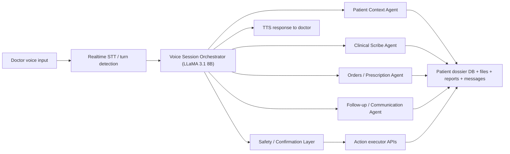

# Voice Agent Workflow for Doctor Post-Patient Lifecycle

## Goal
Enable doctors to manage the full post-patient lifecycle using voice, while keeping the system safe, auditable, and operationally reliable.

This workflow should allow a doctor to use speech to:
- retrieve patient context
- summarize recent clinical history
- create and update notes
- manage prescriptions and medicines
- schedule follow-ups
- trigger patient communication
- review reports, scans, transcripts, and reminders

## Recommended High-Level Architecture

Use a hybrid architecture:
- `Next.js` remains the doctor-facing UI and control surface
- a separate `Python voice-agent service` handles speech, orchestration, and agent execution
- `LLaMA 3.1 8B` handles basic orchestration, intent parsing, slot filling, and structured planning
- all state-changing actions are routed through explicit confirmation and safety checks
- long-running automation is managed through durable workflows

## End-to-End Workflow

Example doctor voice command:

`Open Priya Sharma. Summarize the last visit. Add a note that cough has improved. Continue azithromycin for three days. Schedule follow-up next Tuesday.`

Backend flow:
1. Capture audio from browser or telephony input.
2. Convert speech to partial and final transcript.
3. Run the transcript through the voice session orchestrator.
4. Detect intent and required entities.
5. Fetch patient dossier context.
6. Route to the correct agent or tool chain.
7. Build a structured action plan.
8. Run safety validation.
9. Read back all state-changing actions.
10. Ask for confirmation.
11. Commit writes only after confirmation.
12. Speak back the result and persist audit logs.

## Core Agents

The system should begin with 5 focused agents.

### 1. Voice Session Orchestrator
Purpose:
- own the active voice session
- classify intent
- route tasks to the right agent
- ask clarifying questions
- manage confirmations and retries

Model:
- `LLaMA 3.1 8B Instruct`

Responsibilities:
- session state
- active patient selection
- turn management
- tool selection
- structured output generation

### 2. Patient Context Agent
Purpose:
- fetch and summarize patient dossier data
- answer clinical-history questions
- provide compact structured context to other agents

Responsibilities:
- retrieve scans, reports, notes, meds, appointments, files, transcripts, messages
- summarize latest events
- surface allergies, risks, and open follow-ups

Data sources:
- patient dossier API
- notes and records DB
- attached files and reports

### 3. Clinical Scribe Agent
Purpose:
- convert doctor dictation into structured notes
- produce visit summaries and handoff notes
- create well-formed clinical draft records

Responsibilities:
- note drafting
- formatting into structured templates
- extracting follow-up instructions from free speech

Outputs:
- draft clinical note
- summary blocks
- structured JSON for saving

### 4. Orders / Prescription Agent
Purpose:
- manage prescription updates and medicine instructions
- convert voice commands into structured medication actions

Responsibilities:
- create draft prescriptions
- add dosage, frequency, duration, timing
- flag missing fields
- check for duplicate or conflicting entries

Outputs:
- prescription draft
- medicine item list
- update plan requiring confirmation

### 5. Follow-up / Communication Agent
Purpose:
- manage all post-visit follow-up automation
- draft and trigger communication tasks

Responsibilities:
- schedule appointments
- create reminders
- send patient messages
- queue email, SMS, or call workflows
- monitor unfinished tasks

Outputs:
- appointment actions
- reminder tasks
- message drafts
- workflow jobs

## Safety and Confirmation Layer

This should be implemented as a system layer, not a casual prompt rule.

It must:
- confirm patient identity before any write action
- require explicit confirmation for:
  - prescriptions
  - medicines
  - follow-up scheduling
  - patient communications
  - updates to important clinical notes
- enforce doctor-only permissions
- run deterministic validation before writes
- maintain audit logs of:
  - transcript
  - interpreted action plan
  - final committed action

## Recommended Technologies

### Frontend and Doctor UI
- `Next.js` existing app
- microphone capture from browser
- optional push-to-talk or always-listening mode with turn detection

### Voice / Realtime Layer
- `LiveKit Agents` for browser-native real-time voice workflows
- `Twilio Media Streams` if phone-call workflows are required

### Orchestration and Agents
- `LangGraph` for graph-based orchestration and multi-step tool workflows
- or `Llama Stack Agents` if you want a more LLaMA-native agent stack

### Model Serving
- `LLaMA 3.1 8B Instruct`
- serve using `vLLM`

### Speech-to-Text
- managed option: `Deepgram`
- self-hosted option: `faster-whisper`

### Text-to-Speech
- managed option through LiveKit-compatible providers
- self-hosted option: `Piper`

### Durable Workflow Automation
- `Temporal`

### Retrieval
- start with direct DB queries for structured records
- add semantic retrieval later using:
  - `Qdrant`
  - `pgvector`

## Possible Implementation Approaches

### Approach 1: Command-First Voice Copilot
Doctor speaks short commands and the system confirms each state-changing action.

Pros:
- fastest to implement
- safer
- lower hallucination risk
- good first version

Cons:
- less conversational

### Approach 2: Conversational Clinical Assistant
Doctor interacts naturally over multiple turns and the system maintains session memory.

Pros:
- better UX
- more natural interaction

Cons:
- more complex state management
- higher risk without strict safety controls

### Approach 3: Telephony Workflow
The same voice agents are used over doctor/patient phone calls or reminder calls.

Pros:
- supports remote care and reminders
- aligns with existing Twilio direction in the repo

Cons:
- added latency and infra complexity

## Recommended Build Order

Start with `Approach 1`, then expand.

### Phase 1: Voice Copilot V1
Support only:
- retrieve patient summary
- create note draft
- schedule follow-up

### Phase 2: Medication and Prescription Support
Add:
- prescription drafting
- medication changes
- allergy and risk checks

### Phase 3: Communication and Automation
Add:
- patient message drafting
- reminders
- follow-up workflow automation
- durable execution

### Phase 4: Full Conversational Workflow
Add:
- richer multi-turn conversation
- contextual follow-ups
- doctor handoff support
- telephony support if needed

## Example Doctor Workflows

### Workflow 1: Quick Summary
Doctor says:
`Open Rahul Verma and summarize the last visit.`

System actions:
- resolve patient identity
- fetch latest dossier
- summarize scans, reports, notes, meds, appointments
- speak response

### Workflow 2: Add Follow-Up Note
Doctor says:
`Add a note that the patient reports reduced chest pain and better sleep.`

System actions:
- draft note
- read back summary
- ask for save confirmation
- store note

### Workflow 3: Update Medication
Doctor says:
`Continue amoxicillin 500 mg twice daily for five more days.`

System actions:
- parse medication details
- check patient context and active prescription
- draft medication update
- confirm before save

### Workflow 4: Schedule Follow-Up
Doctor says:
`Schedule follow-up next Tuesday at 4 PM and remind the patient one day before.`

System actions:
- create appointment draft
- create reminder workflow
- confirm
- persist and trigger downstream automation

### Workflow 5: Communication Review
Doctor says:
`Read the latest unread messages from Priya and draft a reply.`

System actions:
- fetch conversation history
- summarize unread messages
- draft reply
- wait for approval before sending

## Suggested Agent-Tool Mapping

### Voice Session Orchestrator Tools
- `select_patient`
- `get_patient_summary`
- `draft_note`
- `draft_prescription`
- `schedule_followup`
- `draft_message`
- `commit_action`
- `cancel_action`

### Patient Context Agent Tools
- `fetch_dossier`
- `fetch_latest_report`
- `fetch_latest_scan`
- `fetch_active_medicines`
- `fetch_appointments`
- `fetch_files`
- `fetch_voice_transcripts`

### Clinical Scribe Agent Tools
- `create_note_draft`
- `format_structured_note`
- `extract_followup_tasks`

### Orders / Prescription Agent Tools
- `create_prescription_draft`
- `validate_medicine_details`
- `check_duplicate_medication`
- `check_allergy_flags`

### Follow-up / Communication Agent Tools
- `create_appointment_draft`
- `schedule_reminder_workflow`
- `create_message_draft`
- `queue_call_or_sms`

## Safety Principles

The system should follow these principles:
- voice can draft, but not silently commit critical changes
- patient identity must be explicit before write operations
- all medication changes must be confirmed
- communication to patients should remain human-approved
- every action should be auditable
- long-running work should not depend on short-lived chat session memory

## Best-Fit Recommendation for This Repo

Because the current project is already:
- `Next.js`
- `TypeScript`
- `Drizzle`
- `SQLite`
- a separate `Python` ML service

the most practical architecture is:
- `Next.js` for doctor UI
- a separate `Python voice-agent service`
- `LiveKit Agents`
- `LangGraph`
- `vLLM` serving `LLaMA 3.1 8B`
- `Deepgram` or `faster-whisper` for STT
- `Temporal` for workflow automation

If stronger Meta alignment is important, replace `LangGraph` with `Llama Stack Agents`.

## First Build Recommendation

Build the first version as a `voice command copilot`, not a fully autonomous conversational doctor agent.

Start with these 3 supported tasks:
- `retrieve patient summary`
- `create or update note`
- `schedule follow-up`

Once those are stable, add:
- prescription workflows
- patient communication workflows
- durable follow-up automations

## Future Extensions

Possible future additions:
- telephony-based doctor or patient workflows
- multilingual doctor dictation
- smart handoff summaries between visits
- medication adherence monitoring
- proactive reminder escalations
- doctor dashboard voice inbox

## References

- LiveKit Agents voice pipelines
- Twilio Media Streams
- Meta LLaMA 3.1 8B Instruct
- vLLM OpenAI-compatible serving
- Llama Stack Agents
- LangGraph workflows and agents
- Temporal durable workflows
- Deepgram streaming STT
- faster-whisper

